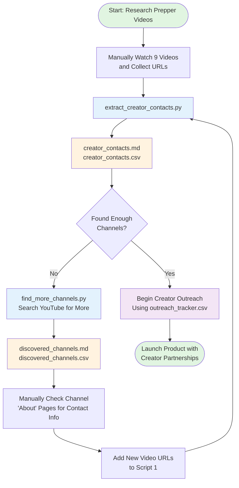
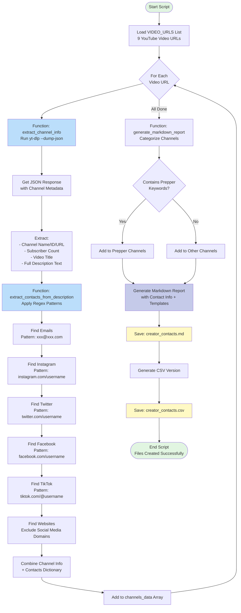
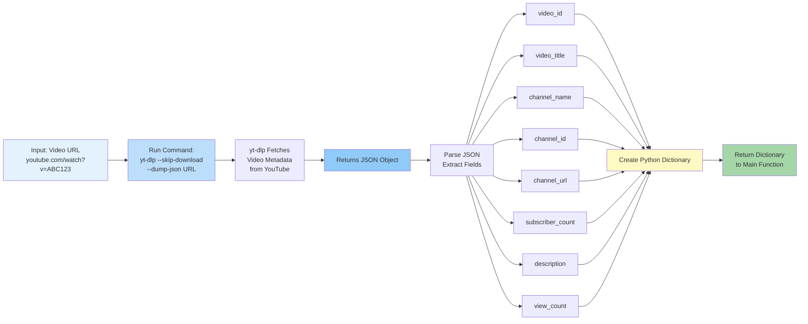
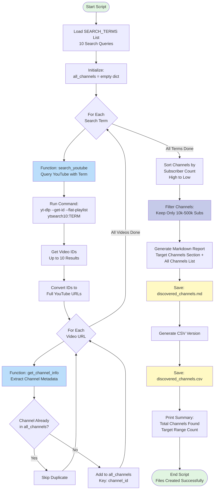
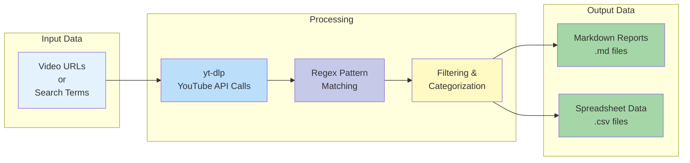
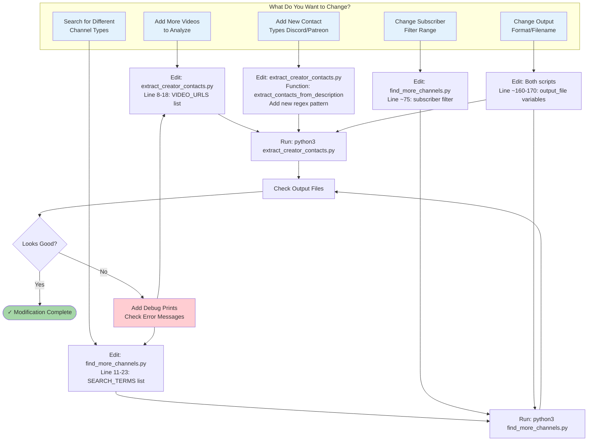
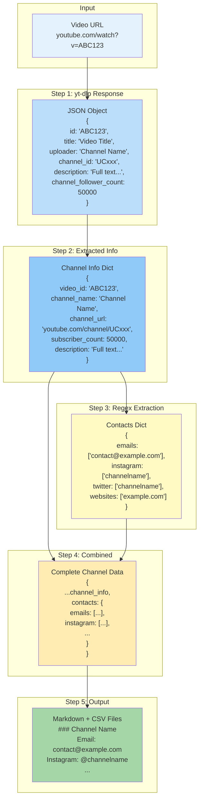
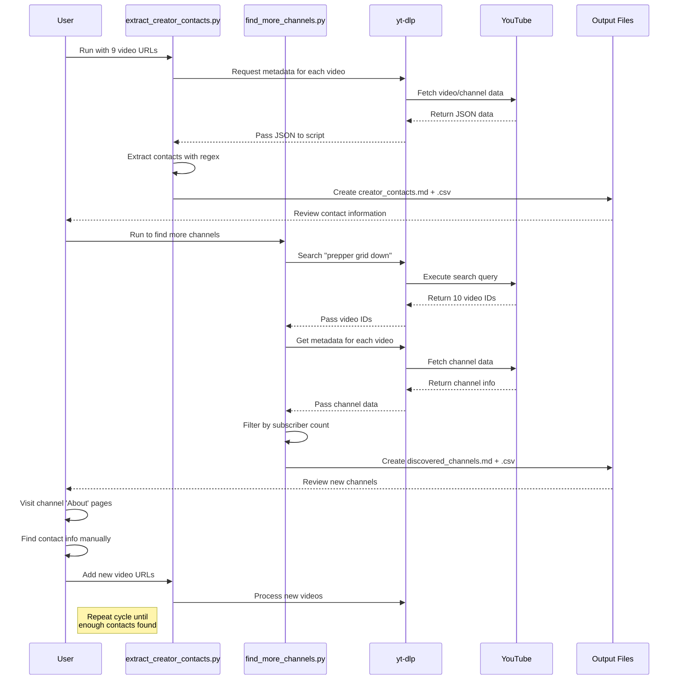
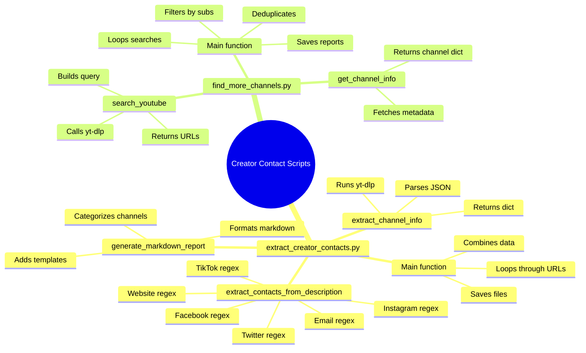
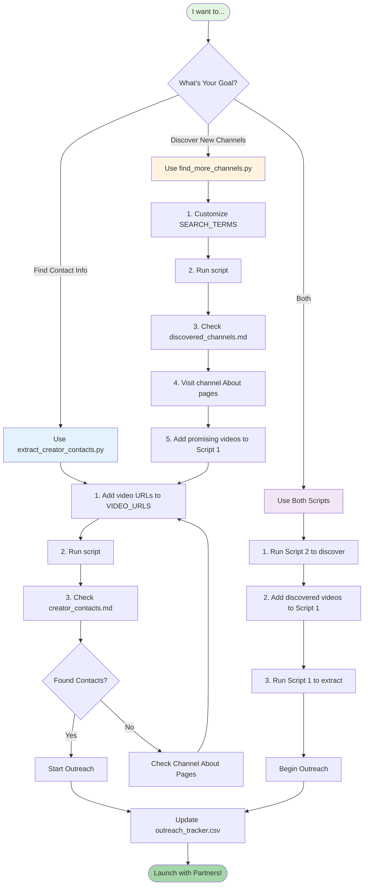

# Script Flow - Mermaid Diagrams

These diagrams can be rendered in GitHub, VS Code (with Mermaid extension), or any Mermaid viewer.

---

## 📊 High-Level System Overview



---

## 🔍 Script 1: extract_creator_contacts.py

### Main Flow



### Detailed: extract_channel_info() Function



### Detailed: extract_contacts_from_description() Function

```mermaid
flowchart TB
    Input[Input: Description Text<br/>Full video description string]
    
    Input --> Init[Initialize Empty<br/>Contacts Dictionary]
    
    Init --> Email[Apply Email Regex<br/>Pattern: xxx@domain.com]
    Email --> EmailFound{Emails<br/>Found?}
    EmailFound -->|Yes| SaveEmail[Add to contacts['emails']]
    EmailFound -->|No| NextInsta[Continue]
    SaveEmail --> NextInsta
    
    NextInsta --> Insta[Apply Instagram Regex<br/>Pattern: instagram.com/USER]
    Insta --> InstaFound{Instagram<br/>Found?}
    InstaFound -->|Yes| SaveInsta[Add to contacts['instagram']]
    InstaFound -->|No| NextTwitter[Continue]
    SaveInsta --> NextTwitter
    
    NextTwitter --> Twitter[Apply Twitter Regex<br/>Pattern: twitter.com/USER]
    Twitter --> TwitterFound{Twitter<br/>Found?}
    TwitterFound -->|Yes| SaveTwitter[Add to contacts['twitter']]
    TwitterFound -->|No| NextFB[Continue]
    SaveTwitter --> NextFB
    
    NextFB --> FB[Apply Facebook Regex<br/>Pattern: facebook.com/USER]
    FB --> FBFound{Facebook<br/>Found?}
    FBFound -->|Yes| SaveFB[Add to contacts['facebook']]
    FBFound -->|No| NextTT[Continue]
    SaveFB --> NextTT
    
    NextTT --> TikTok[Apply TikTok Regex<br/>Pattern: tiktok.com/@USER]
    TikTok --> TTFound{TikTok<br/>Found?}
    TTFound -->|Yes| SaveTT[Add to contacts['tiktok']]
    TTFound -->|No| NextWeb[Continue]
    SaveTT --> NextWeb
    
    NextWeb --> Web[Apply Website Regex<br/>Pattern: https?://domain.com]
    Web --> WebFilter[Filter Out<br/>Social Media Domains]
    WebFilter --> WebFound{Websites<br/>Found?}
    WebFound -->|Yes| SaveWeb[Add to contacts['websites']]
    WebFound -->|No| Cleanup[Clean Up Duplicates]
    SaveWeb --> Cleanup
    
    Cleanup --> Output[Return Complete<br/>Contacts Dictionary]
    
    style Input fill:#e3f2fd
    style Init fill:#c5cae9
    style Output fill:#a5d6a7
    style Email fill:#fff9c4
    style Insta fill:#fff9c4
    style Twitter fill:#fff9c4
    style FB fill:#fff9c4
    style TikTok fill:#fff9c4
    style Web fill:#fff9c4
```

---

## 🔎 Script 2: find_more_channels.py

### Main Flow



### Detailed: search_youtube() Function

```mermaid
flowchart LR
    Input[Input: Search Query<br/>e.g., 'prepper grid down'<br/>max_results: 10]
    
    Input --> BuildQuery[Build yt-dlp Query:<br/>ytsearch10:QUERY]
    
    BuildQuery --> Command[Run Command:<br/>yt-dlp --skip-download<br/>--get-id --flat-playlist<br/>ytsearchN:QUERY]
    
    Command --> YTSearch[yt-dlp Searches<br/>YouTube with Query]
    
    YTSearch --> GetResults[Returns Video IDs<br/>One per line]
    
    GetResults --> Parse[Parse Output:<br/>Split by Newlines]
    
    Parse --> IDs[List of Video IDs<br/>['abc123', 'def456', ...]]
    
    IDs --> Convert[Convert Each ID to URL<br/>youtube.com/watch?v=ID]
    
    Convert --> URLs[List of Full URLs]
    
    URLs --> Output[Return URL List<br/>to Main Function]
    
    style Input fill:#e3f2fd
    style Command fill:#bbdefb
    style YTSearch fill:#90caf9
    style URLs fill:#fff9c4
    style Output fill:#a5d6a7
```

### Data Flow Through Scripts



---

## 🎨 Modification Points (Interactive)



---

## 🔄 Data Structure Transformations

### How Data Changes Through Script 1



---

## 🎯 Real-World Usage Flow



---

## 📊 Key Functions Map



---

## 🛠️ How to View These Diagrams

### Option 1: GitHub
Upload this file to GitHub - diagrams render automatically!

### Option 2: VS Code
Install the "Markdown Preview Mermaid Support" extension

### Option 3: Online Viewer
Copy any diagram and paste into: https://mermaid.live/

### Option 4: Export as Image
Use Mermaid Live Editor to export as PNG/SVG

---

## 💡 Interactive Diagram: Choose Your Path



---

## 🔍 Detailed Regex Pattern Flow

```mermaid
flowchart LR
    subgraph "Input Text"
        Text["Follow us on Instagram:<br/>instagram.com/channelname<br/>Email: contact@example.com<br/>Visit: example.com"]
    end
    
    subgraph "Regex Patterns"
        P1[Email Pattern<br/>[A-Za-z0-9._%+-]+@...]
        P2[Instagram Pattern<br/>instagram.com/...]
        P3[Website Pattern<br/>https?://...]
    end
    
    subgraph "Matches Found"
        M1[contact@example.com]
        M2[channelname]
        M3[example.com]
    end
    
    subgraph "Organized Output"
        Out["contacts = {<br/>  'emails': ['contact@example.com'],<br/>  'instagram': ['channelname'],<br/>  'websites': ['example.com']<br/>}"]
    end
    
    Text --> P1
    Text --> P2
    Text --> P3
    
    P1 --> M1
    P2 --> M2
    P3 --> M3
    
    M1 --> Out
    M2 --> Out
    M3 --> Out
    
    style Text fill:#e3f2fd
    style P1 fill:#fff9c4
    style P2 fill:#fff9c4
    style P3 fill:#fff9c4
    style Out fill:#a5d6a7
```

---

**Copy any diagram above and paste into [mermaid.live](https://mermaid.live/) to see it rendered beautifully!**

