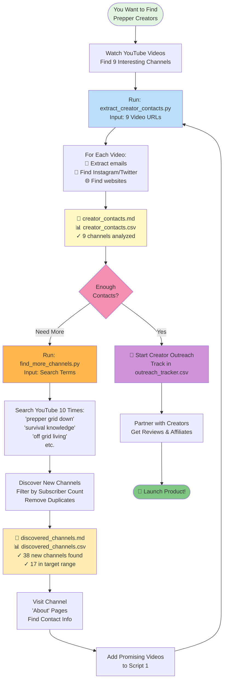
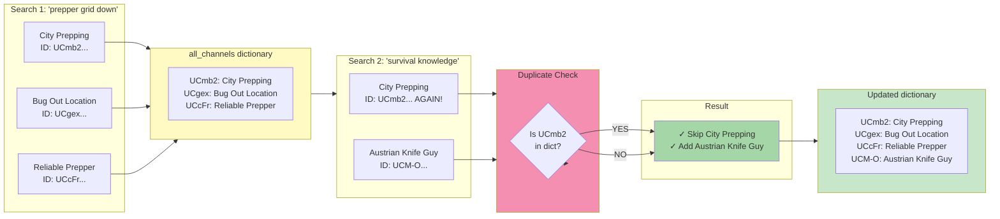
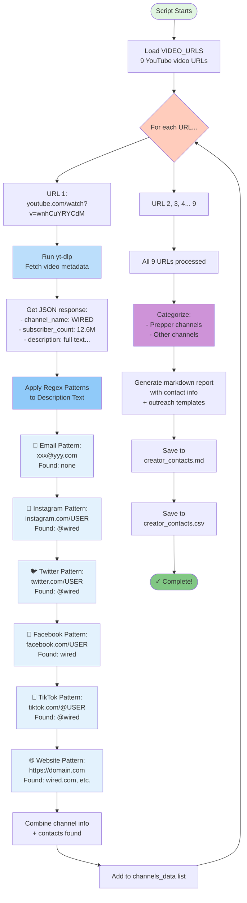
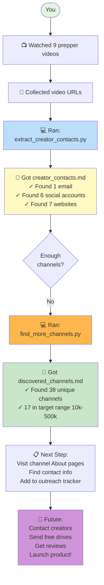
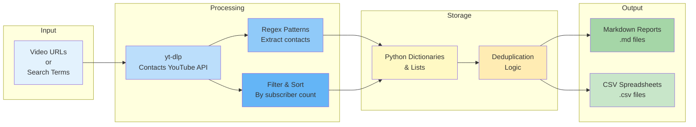
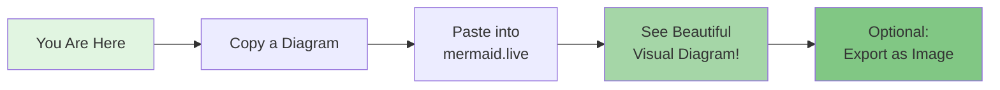

# Simple Flow Diagrams - Ready to Render

Copy any of these diagrams and paste into **https://mermaid.live/** to see them rendered!

---

## 🎯 Quick Overview: How Both Scripts Work Together

**Copy this entire block (including the ```mermaid) and paste into mermaid.live:**



---

## 🔍 How find_more_channels.py Works (Simplified)

**Copy and render this:**

```mermaid
flowchart TD
    Start([Script Starts])
    
    Start --> Init[all_channels = {}<br/>Empty dictionary]
    
    Init --> Loop1[Loop 1 of 10<br/>Search: 'prepper grid down']
    
    Loop1 --> YT1[YouTube Search<br/>Returns 5 video URLs]
    
    YT1 --> Loop2[For each of 5 URLs...]
    
    Loop2 --> Get1[Get channel info<br/>from video]
    
    Get1 --> Check1{Channel ID<br/>already in<br/>dictionary?}
    
    Check1 -->|No - New!| Add1[✓ Add to all_channels<br/>Print: ✓ Channel Name]
    
    Check1 -->|Yes - Dupe| Skip1[⏭️ Skip<br/>Already have it]
    
    Add1 --> Next1[Next URL...]
    Skip1 --> Next1
    
    Next1 --> Loop3[Loop 2 of 10<br/>Search: 'survival knowledge']
    
    Loop3 --> YT2[YouTube Search<br/>Returns 5 more URLs]
    
    YT2 --> Process[Same process...<br/>Get info, check dupes,<br/>add if new]
    
    Process --> More[Loops 3-10...<br/>8 more searches]
    
    More --> Done[All 10 searches complete]
    
    Done --> Count[Total: 38 unique channels<br/>in all_channels dict]
    
    Count --> Sort[Sort by<br/>subscriber count]
    
    Sort --> Filter[Filter:<br/>Keep only 10k-500k subs<br/>Result: 17 channels]
    
    Filter --> Save1[Save to<br/>discovered_channels.md]
    
    Save1 --> Save2[Save to<br/>discovered_channels.csv]
    
    Save2 --> End([✓ Complete!])
    
    style Start fill:#e1f5e1
    style Loop1 fill:#ffccbc
    style Loop3 fill:#ffab91
    style Check1 fill:#f48fb1
    style Add1 fill:#a5d6a7
    style Skip1 fill:#ff8a65
    style Filter fill:#ce93d8
    style End fill:#81c784
```

---

## 🔄 The Deduplication Magic

**Copy and render this:**



---

## 📧 How extract_creator_contacts.py Works

**Copy and render this:**



---

## 🎯 Your Actual Workflow (What You Just Did)

**Copy and render this:**



---

## 🔢 Data Flow Through Scripts

**Copy and render this:**



---

## 🎨 How to View These Diagrams

### Option 1: Online (Easiest - Do This Now!)

1. Go to **https://mermaid.live/**
2. Copy ANY diagram above (including the \`\`\`mermaid and \`\`\`)
3. Paste into the left panel
4. See beautiful rendered diagram on the right!
5. Export as PNG/SVG if you want

### Option 2: VS Code

1. Install extension: **"Markdown Preview Mermaid Support"**
2. Open this file (`SIMPLE_FLOW_DIAGRAM.md`)
3. Click the preview button (top right)
4. All diagrams render automatically!

### Option 3: GitHub

1. Push this file to GitHub
2. Diagrams auto-render in the browser
3. Share link with others

---

## 🚀 Try It Right Now!

**Copy this block and paste into https://mermaid.live/:**



---

## 📊 All Your Documentation Files

```
Diagrams (Visual):
├── SIMPLE_FLOW_DIAGRAM.md ← YOU ARE HERE (easiest to render)
├── MERMAID_DIAGRAMS.md (comprehensive workflows)
├── PYTHON_CODE_DIAGRAMS.md (code internals)
└── FIND_MORE_CHANNELS_DIAGRAM.md (channel finder details)

Guides (Text):
├── QUICK_MODIFICATION_GUIDE.md (copy-paste changes)
├── VIEW_DIAGRAMS.md (how to view)
└── README.md (getting started)

Data (Results):
├── creator_contacts.md + .csv (9 original channels)
├── discovered_channels.md + .csv (38 new channels)
└── outreach_tracker.csv (track your outreach)

Strategy:
├── knowledge_drive_research.md (market research)
└── action_plan.md (step-by-step plan)
```

---

**🎯 Action: Go to https://mermaid.live/ right now and paste the first diagram!**

