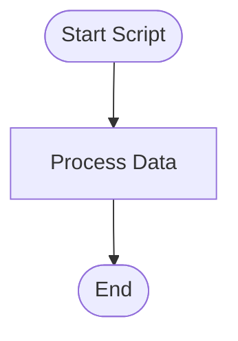
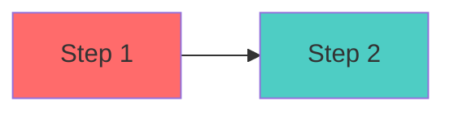

# 📊 How to View Your Mermaid Diagrams

Your script flow is now documented with professional Mermaid diagrams in `MERMAID_DIAGRAMS.md`!

---

## 🎨 What's Inside

The file contains **12 different diagrams**:

1. **High-Level System Overview** - How both scripts work together
2. **Script 1 Main Flow** - Complete extract_creator_contacts.py flow
3. **extract_channel_info() Function** - Detailed function breakdown
4. **extract_contacts_from_description() Function** - Regex pattern application
5. **Script 2 Main Flow** - Complete find_more_channels.py flow
6. **search_youtube() Function** - YouTube search process
7. **Data Flow Diagram** - Input → Processing → Output
8. **Modification Points** - Interactive guide for changes
9. **Data Structure Transformations** - How data changes at each step
10. **Real-World Usage Flow** - Sequence diagram of script execution
11. **Key Functions Map** - Mind map of all functions
12. **Choose Your Path** - Interactive decision flowchart

---

## 👀 3 Ways to View the Diagrams

### Option 1: Online Viewer (Easiest - No Install)

1. Go to: **https://mermaid.live/**
2. Open `MERMAID_DIAGRAMS.md`
3. Copy any diagram (including the triple backticks with `mermaid`)
4. Paste into the left panel of Mermaid Live
5. See beautiful rendered diagram on the right!
6. Export as PNG/SVG if you want

**Example - Copy this block:**
```

```

### Option 2: VS Code Extension (Best for Editing)

1. Open VS Code
2. Install extension: **"Markdown Preview Mermaid Support"**
   - Go to Extensions (Cmd+Shift+X)
   - Search "Markdown Preview Mermaid"
   - Install it
3. Open `MERMAID_DIAGRAMS.md`
4. Click the preview button (top right corner)
5. See all diagrams rendered in real-time!

### Option 3: GitHub (Best for Sharing)

1. Create a GitHub repo (or use existing)
2. Upload `MERMAID_DIAGRAMS.md`
3. View on GitHub - it auto-renders Mermaid diagrams!
4. Share the link with others

---

## 🎯 Quick Start: See Your First Diagram

**Right now, copy this and paste into https://mermaid.live/:**

```mermaid
flowchart TD
    Start([You Found 9 Prepper Videos])
    
    Start --> Script1[Run: extract_creator_contacts.py]
    
    Script1 --> Extract[Extract for each video:<br/>✓ Channel name & URL<br/>✓ Subscriber count<br/>✓ Email addresses<br/>✓ Instagram/Twitter/Facebook<br/>✓ Website links]
    
    Extract --> Output1[creator_contacts.md<br/>creator_contacts.csv]
    
    Output1 --> Check{Enough<br/>Contacts?}
    
    Check -->|No, need more| Script2[Run: find_more_channels.py]
    
    Script2 --> Search[Search YouTube for:<br/>"prepper grid down"<br/>"survival knowledge"<br/>etc.]
    
    Search --> Discover[Discover 50+ more channels<br/>Filter: 10k-500k subscribers]
    
    Discover --> Output2[discovered_channels.md<br/>discovered_channels.csv]
    
    Output2 --> Manual[Visit channel 'About' pages<br/>Find contact info]
    
    Manual --> Add[Add videos to Script 1]
    
    Add --> Script1
    
    Check -->|Yes| Outreach[Start Creator Outreach!<br/>Use outreach_tracker.csv]
    
    Outreach --> Success([Product Launch with<br/>Creator Partnerships])
    
    style Start fill:#e1f5e1
    style Success fill:#c8e6c9
    style Script1 fill:#bbdefb
    style Script2 fill:#bbdefb
    style Outreach fill:#f3e5f5
```

**You should see a beautiful flowchart appear!**

---

## 📚 What Each Diagram Shows You

### System Overview
Shows how both scripts work together in your workflow

### Main Flows
Step-by-step execution of each script - perfect for understanding the logic

### Function Details
Zoom into specific functions to see exactly what they do

### Data Transformations
See how raw YouTube URLs become organized contact lists

### Sequence Diagram
Timeline of how the scripts interact with yt-dlp and YouTube

### Modification Guide
Interactive flowchart showing where to edit for common changes

---

## 💡 Using Diagrams for Modifications

**Want to add a new contact type (like Discord)?**

1. Look at the "extract_contacts_from_description() Function" diagram
2. See the pattern: Input → Regex → Check → Save → Next
3. Add your new step in that flow
4. Update the actual code following the same pattern

**Want to change the subscriber filter?**

1. Look at the "Script 2 Main Flow" diagram
2. Find the "Filter Channels" step
3. That's line ~75 in `find_more_channels.py`
4. Change the numbers there

---

## 🎨 Customize the Diagrams

The diagrams are just text! You can:

- Copy any diagram
- Modify it for your needs
- Add your own steps
- Change colors
- Add more detail

**Example - Change colors:**


---

## 📖 Mermaid Syntax Quick Reference

**Flowchart shapes:**
- `[Text]` - Rectangle
- `([Text])` - Rounded (Start/End)
- `{Text}` - Diamond (Decision)
- `((Text))` - Circle

**Arrows:**
- `-->` - Solid arrow
- `-.->` - Dotted arrow
- `==>` - Thick arrow

**Colors:**
- `style NodeName fill:#color`

**Learn more:** https://mermaid.js.org/intro/

---

## 🚀 Next Steps

1. **View your diagrams** using Option 1 (mermaid.live) right now
2. **Install VS Code extension** for local viewing
3. **Use diagrams as reference** when modifying scripts
4. **Share with collaborators** if you have a team

---

## 💻 Example: View in Terminal (ASCII Preview)

Want a quick terminal preview? Install mmdc:

```bash
# Install mermaid-cli
npm install -g @mermaid-js/mermaid-cli

# Convert diagram to image
mmdc -i MERMAID_DIAGRAMS.md -o diagram.png
```

---

## 📱 Mobile Viewing

1. Open mermaid.live on your phone
2. Copy diagram from `MERMAID_DIAGRAMS.md`
3. Paste and view!

Or use GitHub mobile app to view the file directly.

---

## ✨ Pro Tip: Live Editing

1. Open VS Code with Mermaid extension
2. Split view: code on left, preview on right
3. Edit diagram → see changes instantly
4. Perfect for customizing diagrams for your workflow

---

**Your diagrams are ready in `MERMAID_DIAGRAMS.md`!**

**Try it now:** Copy the flowchart above and paste into https://mermaid.live/ 🎉

